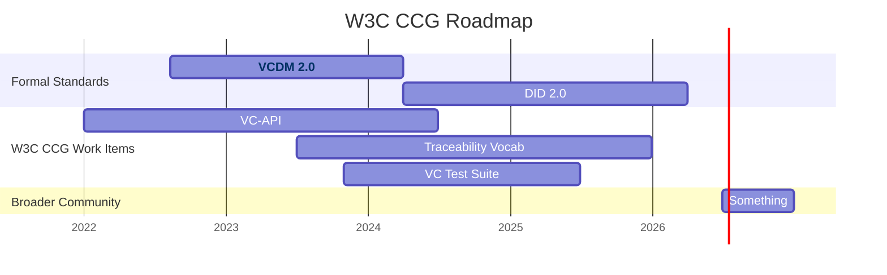

```mermaid

gantt
    tickInterval 12month
    dateFormat  YYYY-MM-DD
    title W3C CCG Roadmap
    axisFormat  %Y

     section Formal Standards
    VCDM 2.0: vcdm, 2022-08-11, 2024-04-01 
    DID 2.0: 2024-04-01, 2026-04-01

    click vcdm href "https://w3c.github.io/vc-data-model"

    section W3C CCG Work Items
    VC-API: 2022-01-01, 2024-06-30
    Traceability Vocab: 2023-07-01, 2025-12-31
    VC Test Suite: 2023-11-01, 2025-06-30

    section Broader Community
    Something: 2026-07-01, 2026-12-31
    
```